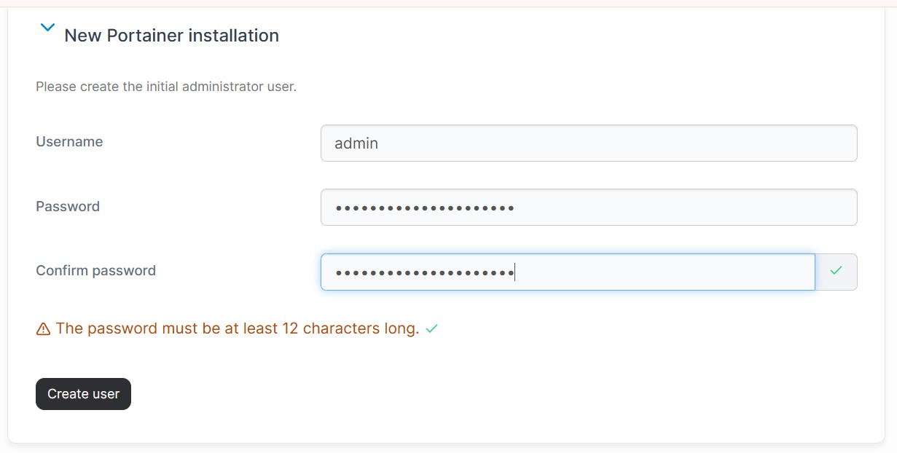
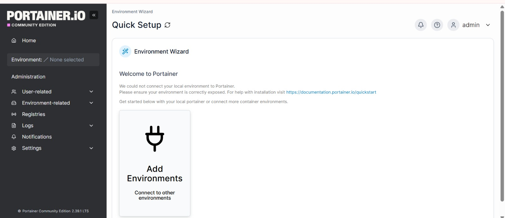

# Portainer

## Deployment

Según la documentación, https://docs.portainer.io/start/install-ce/server/docker/linux#docker-compose se puede desplegar Portainer usando docker run o a través de Docker Compose. Elegimos la segunda opción.

```
services:
  portainer:
    container_name: portainer
    image: portainer/portainer-ce:sts # aquí usaremos la última imagen, no sts
    restart: always
    volumes:
      - /var/run/docker.sock:/var/run/docker.sock
      - portainer_data:/data
    ports: # cambiaremos los puertos por 9000, especificado en la consiga del trabajo
      - 9443:9443
      - 8000:8000  # Remove if you do not intend to use Edge Agents

volumes:
  portainer_data:
    name: portainer_data

networks: # sacamos la creación de la red portainer_network para que use la de defecto
  default:
    name: portainer_network
```

Agregamos el siguiente bloque al docker-compose.yml:

```
services:
  portainer:
    container_name: portainer
    image: portainer/portainer-ce:latest
    restart: always
    volumes:
      - /var/run/docker.sock:/var/run/docker.sock
      - portainer_data:/data
    ports: 
      - 9000:9000
    deploy: # agregamos limites de cpu y memoria para agregarle calidad al proyecto
      resources:
        limits:
          cpus: '0.5'
          memory: 256M

volumes:
  portainer_data:
    name: portainer_data
```

El próximo paso es hacer 
``` bash
docker compose up -d
```
---

## Logging in

Ya levantado el contenedor, vamos al puerto 9000 donde creamos un usuario en Portainer:





---