# Portainer

## Deployment

Según la documentación, https://docs.portainer.io/start/install-ce/server/docker/linux#docker-compose se puede desplegar Portainer usando docker run o a través de Docker Compose. Elegimos la segunda opción.

```
services:
  portainer:
    container_name: portainer
    image: portainer/portainer-ce:sts # dejamos sts para seguir la rama estable de soporte
    restart: always
    volumes:
      - /var/run/docker.sock:/var/run/docker.sock
      - portainer_data:/data
    ports: # cambiaremos los puertos por 9000, especificado en la consiga del trabajo
      - 9443:9443
      - 8000:8000  # Remove if you do not intend to use Edge Agents

volumes:
  portainer_data:
    name: portainer_data

networks: # sacamos la creación de la red portainer_network para que use la de defecto
  default:
    name: portainer_network
```

Agregamos el siguiente bloque al docker-compose.yml:

```
services:
  portainer:
    container_name: portainer
    image: portainer/portainer-ce:sts
    restart: always
    volumes:
      - /var/run/docker.sock:/var/run/docker.sock
      - portainer_data:/data
    ports: 
      - 9000:9000
    deploy: # agregamos limites de cpu y memoria para agregarle calidad al proyecto
      resources:
        limits:
          cpus: '0.5'
          memory: 256M

volumes:
  portainer_data:
    name: portainer_data
```

El próximo paso es hacer 
``` bash
docker compose up -d
```
---

## Logging in

Ya levantado el contenedor, vamos al puerto 9000 donde creamos un usuario en Portainer:


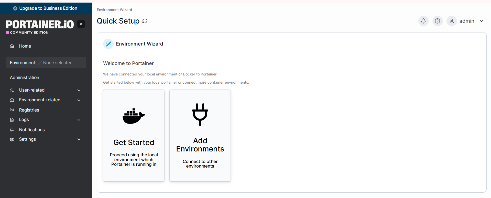

---

## Creating enviroment

Elegimos Docker Standalone:
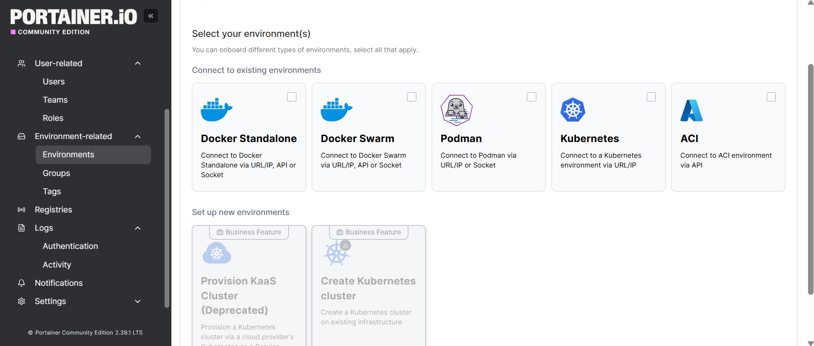

Elegimos la opción Socket (el cable configurado en el docker-compose.yml)
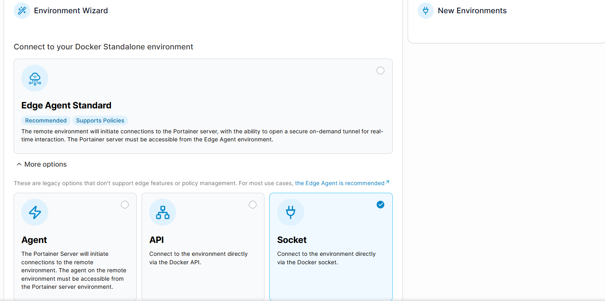

Elegimos la opción linux, cuya flag tiene la misma ruta que pusimos en el docker-compose.yml y creamos el entorno bajo el nombre "local"
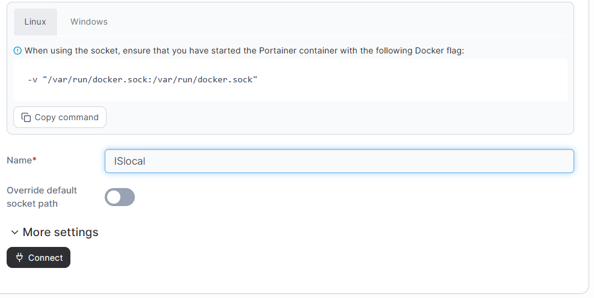

(aclaración: la captura dice que se llama ISlocal pero el nombre fue modificado en el segundo intento de creación, ya que el primero no se pudo concretar por un error "Failure. Forbidden - origin invalid")

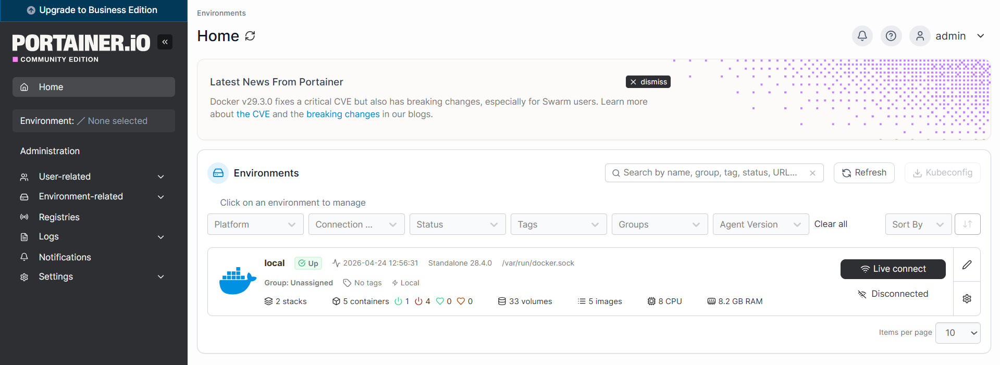

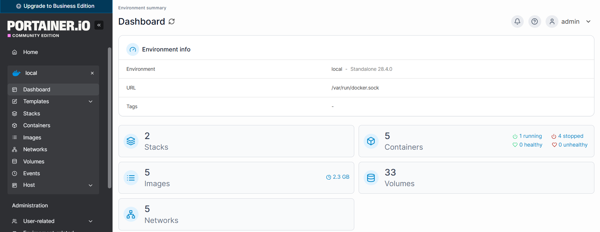

---

## Agregamos la base de datos

Agregamos las imagenes de la base de datos. Ejecutamos:

``` bash
docker compose down

git merge main

docker compose up -d --build
```
Ingresamos con el usuario y contraseña
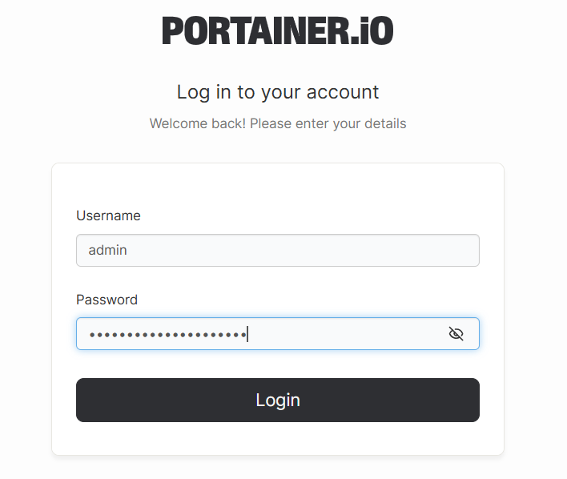

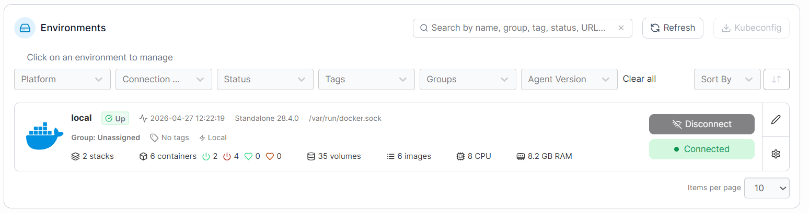

- Accedemos a los contenedores:
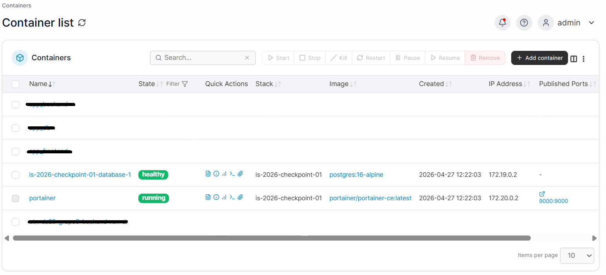
(Aclaración: las filas superiores y la última aparecen tachadas/vacías son contenedores locales que no forman parte del trabajo)
Observamos que aparece la de la base de datos corriendo en un contenedor is-2026-checkpoint-01-database-1, ademas de la del portainer
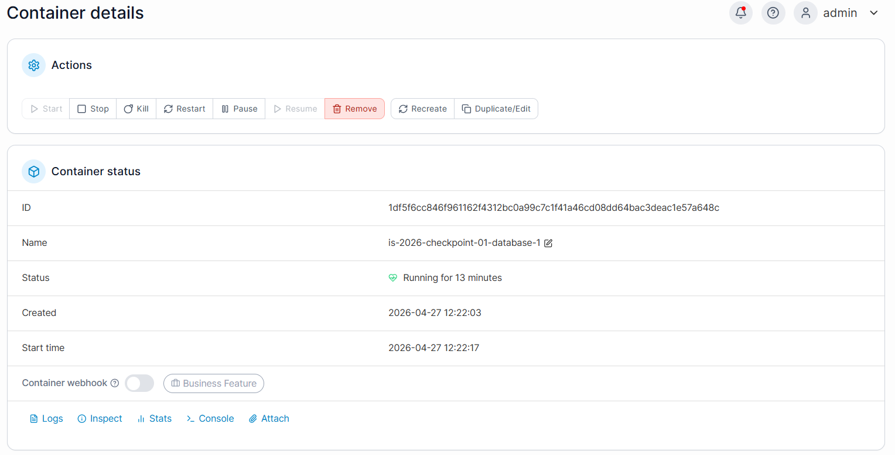

- Accedemos a los volúmenes:
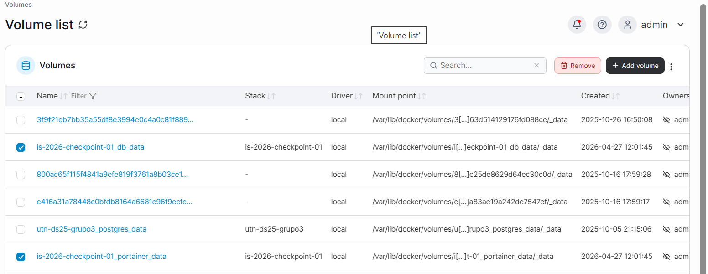
De los cuales solo corresponden al trabajo los seleccionados, correspondiendo uno al contenedor de portainer y otro al de la base de datos.

- Accedemos a los stacks:
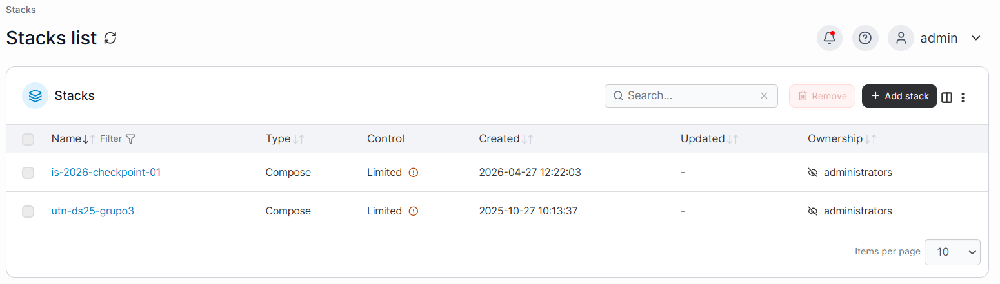

---
 ## Agregamos el Back-End
Agregamos las imagenes del Back-End. Ejecutamos:

 ``` bash
docker compose down

git merge main

docker compose up -d --build
```
Ingresamos con el usuario y contraseña

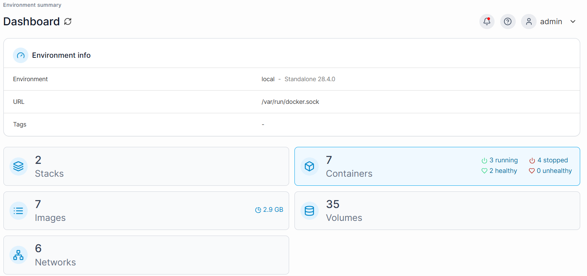

- Accedemos a los contenedores:
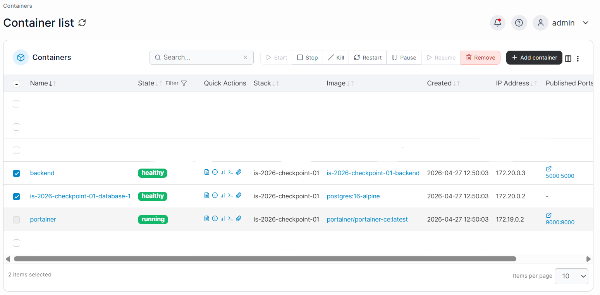
(Aclaración: las filas superiores y la última aparecen tachadas/vacías son contenedores locales que no forman parte del trabajo)
Observamos que aparece la de la base de datos corriendo en un contenedor is-2026-checkpoint-01-database-1 y el Back-End en backend, ademas de la del portainer
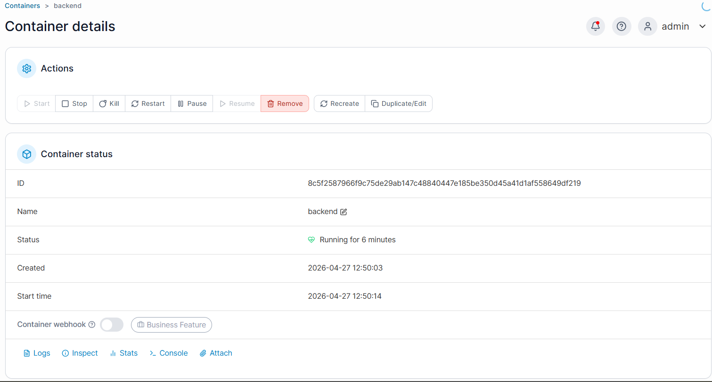

- Accedemos a las imagenes:
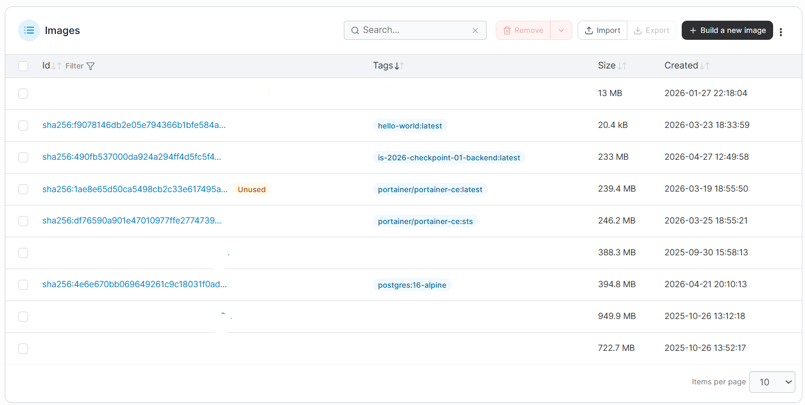
(Aclaración: las filas vacias no forman parte de este trabajo)